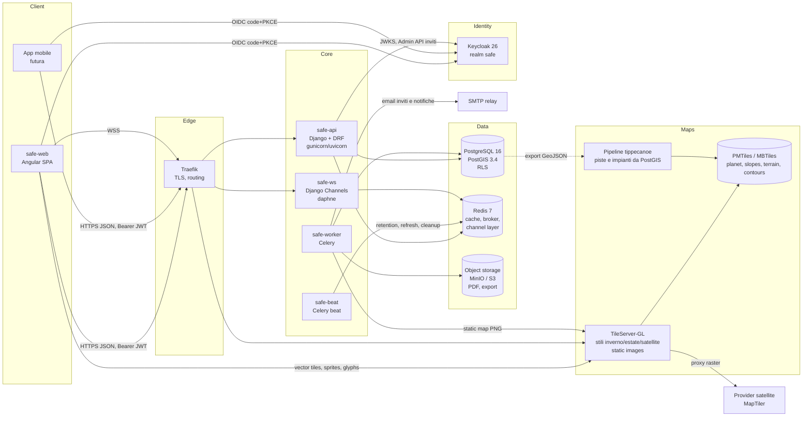
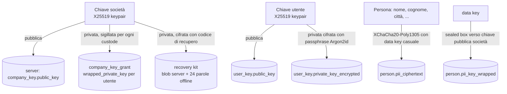

# 01 · Architettura

## 1. Visione

SAFE è una piattaforma multi-tenant per la raccolta (mobile, futura), la gestione e l'analisi
degli interventi di soccorso su pista. È composta da:

- **safe-api**: back-end Django/DRF che espone l'API REST versionata `/api/v1/…`, il canale
  WebSocket `/ws/v1/…` e i job asincroni.
- **safe-web**: SPA Angular (back-office) servita come asset statici da nginx.
- **safe-idp**: Keycloak, unico punto di autenticazione (OIDC).
- **safe-tiles**: TileServer-GL con OpenMapTiles + layer proprietari + terrain.
- **safe-db**: PostgreSQL 16 + PostGIS 3.4; **safe-cache**: Redis 7.

Principi:

1. **Il server non vede mai dati identificativi in chiaro** (cifratura end-to-end, vedi §7).
2. **Il tenant è deciso dal server**: `company_id` deriva dall'utente autenticato, mai da parametri.
3. **Aggregazione lato server**: le rotte statistiche restituiscono payload Chart.js pronti.
4. **Stesso build in tutti gli ambienti**: configurazione runtime esterna, per API e SPA.
5. **Mai scartare un record**: ogni dimensione ha la categoria esplicita `unclassified`.

## 2. Diagramma dei componenti



## 3. Flussi principali

### 3.1 Autenticazione e autorizzazione

```mermaid
sequenceDiagram
  participant B as Browser (SPA)
  participant K as Keycloak
  participant A as safe-api
  participant D as PostgreSQL
  B->>B: carica /config/app-config.json
  B->>K: Authorization Code + PKCE (issuer, clientId da config)
  K-->>B: id_token + access_token (JWT, aud=safe-api)
  B->>A: GET /api/v1/me (Bearer)
  A->>K: JWKS (cache 1h)
  A->>A: verifica firma, iss, aud, exp
  A->>D: app_user WHERE oidc_subject = sub
  A->>A: request.tenant = user.company; SET LOCAL app.company_id
  A-->>B: {user, company, teams, permissions{code:bool}, key_status}
```

- Il JWT contiene solo `sub`, `email`, `preferred_username`. Ruoli e permessi vivono nel DB
  applicativo: Keycloak autentica, SAFE autorizza.
- Un utente Keycloak senza riga in `app_user` (non invitato) riceve `403 user_not_provisioned`.
- Ogni vista DRF dichiara `required_permissions = ("events.view",)`; la permission class
  verifica la mappa effettiva dell'utente (cache Redis 60 s, invalidata alla modifica).
- Il client usa la stessa mappa per mostrare le funzioni bloccate con messaggio informativo;
  la protezione reale è server-side ed è coperta da test automatici per ogni rotta.

### 3.2 Isolamento multi-tenant (tre livelli)

| Livello | Meccanismo | Cosa previene |
|---|---|---|
| Middleware | `TenantMiddleware` risolve `request.tenant` dall'utente; i parametri `company`/`companies` non esistono nell'API | manipolazione da client |
| ORM | `TenantManager` su tutti i modelli tenant: `Model.objects` è già filtrato per `request.tenant` (context var); le viste ereditano da `TenantModelViewSet` | dimenticanze del programmatore |
| Database | Row Level Security su ogni tabella tenant con policy `company_id = current_setting('app.company_id')::uuid`; il ruolo `safe_app` non è owner e non ha `BYPASSRLS`; `SET LOCAL` a inizio transazione da middleware | bug residui, SQL raw, job |

I job Celery ricevono sempre `company_id` esplicito e aprono la transazione con lo stesso `SET LOCAL`.
Il superuser di piattaforma (`is_platform_admin`) opera con un ruolo DB separato ed è
limitato all'amministrazione (creazione società), non ai dati.

### 3.3 Statistiche

```
GET /api/v1/stats/demographics/age-gender?season=2025/2026&zone=…&team=…
  → StatsFilterSet (uniforme) → QuerySet filtrato per tenant
  → aggregatore SQL (GROUP BY age_class, gender con COALESCE → 'unclassified')
  → ChartPayloadBuilder (labels ordinati da lookup, dataset per serie, colori da palette)
  → cache Redis key = (company, endpoint, filtri normalizzati, data_version)
```

- `data_version` è un contatore per società incrementato da un trigger su `event`/`person`:
  ogni scrittura invalida implicitamente la cache.
- Le classi d'età sono calcolate in SQL da `age` con `CASE` parametrico sul cluster richiesto
  (`age_cluster=standard|veneto_a01`).
- Target < 2 s su 100k eventi: indici compositi (§ schema), query singola per grafico, nessun
  N+1, benchmark in CI con dataset sintetico da 100k eventi / 110k persone.

### 3.4 Job asincroni

`POST /api/v1/exports` e `GET /events/{id}/report.pdf` (prima richiesta) creano un `async_job`
(`queued → running → done|failed`) e rispondono `202 {job_id}`; il client fa polling su
`/jobs/{id}` (o riceve `job.completed` via WebSocket) e scarica da `/jobs/{id}/download`
(URL firmato a scadenza breve, senza dati personali). Il PDF è cacheato per `(event_id, updated_at)`.

PDF: template HTML + WeasyPrint; la mappa del luogo è un PNG richiesto a TileServer-GL
(`/styles/winter/static/{lon},{lat},{zoom}/400x400.png`) con overlay del marker.

### 3.5 WebSocket (predisposizione)

- Endpoint `wss://…/ws/v1/realtime/`, autenticazione con primo messaggio `{"type":"auth","token":"…"}`
  (mai token in query string). Dopo l'auth il consumer entra nel gruppo `company.{id}`.
- Messaggi previsti: `job.completed`, `event.created`, `vehicle.position` (futuro, dai dispositivi).
- Channel layer Redis; nessuna logica di mappa live in questa fase, solo consumer, auth, test.

## 4. Front-end

- Angular 20 standalone + signals; PrimeNG (tabella, filtri, dialog, toast, skeleton), Chart.js 4
  con `ng2-charts`, MapLibre GL JS 5, Transloco (IT/EN/DE runtime, file `i18n/{lang}.json`),
  `angular-oauth2-oidc` (code + PKCE, silent refresh).
- **Config runtime**: `assets/config/app-config.json` caricata in `provideAppInitializer`:
  ```json
  { "version": "1.0.0",
    "oidc": { "issuer": "https://idp.example/realms/safe", "clientId": "safe-web" },
    "apiBaseUrl": "https://api.example", "wsBaseUrl": "wss://api.example",
    "tilesBaseUrl": "https://tiles.example", "satelliteKey": "…", "defaultLocale": "it" }
  ```
  L'immagine nginx monta il file da ConfigMap/volume: stesso bundle in dev/stage/prod.
- **Filtri globali**: `FilterStore` (signal) ↔ query string (`team`, `season`, `date_from`,
  `date_to`, `ski_area`, `zone`, `valid_only`) tramite `Router` + `withComponentInputBinding`;
  ogni pagina legge il `FilterStore`, ogni richiesta API lo serializza con lo stesso helper.
  URL condivisibile: il deep-link ripristina i filtri prima della prima chiamata.
- **Permessi**: `PermissionService` espone `can('events.view')`; direttiva `*safeCan` mostra il
  contenuto in stato "bloccato" (overlay + messaggio + contatto amministratore) invece di nasconderlo.
- Accessibilità: componenti PrimeNG con `aria-*`, focus management nei dialog, tabelle con
  caption, contrasto AA sui temi, tutte le stringhe via Transloco (lint `no-hardcoded-strings`).

## 5. Cartografia

| Layer | Fonte | Formato | Aggiornamento |
|---|---|---|---|
| Base (strade, idrografia, edifici, toponimi) | OpenMapTiles generato con Planetiler da estratto OSM (Italia + Alpi) | PMTiles | trimestrale |
| Terrain (hillshade) | Copernicus DEM GLO-30 → terrain-RGB | PMTiles raster | una tantum |
| Contour | TINITALY DEM 10 m → linee 50 m | PMTiles | una tantum |
| Piste e impianti | PostGIS (`slope`, `lift`) → GeoJSON → tippecanoe | PMTiles, rigenerato da job | su modifica anagrafica |
| Confini comprensorio | PostGIS `ski_area.boundary` | GeoJSON via API | live |
| Satellite | provider esterno (MapTiler) proxato da TileServer-GL | raster XYZ | live |

Stili MapLibre: `winter` (piste colorate per difficoltà, impianti, hillshade), `summer`
(base OSM chiara, sentieri), `satellite` (raster + piste). Selezionati da menu; il nome dello
stile è nella query string della pagina mappa.

Il layer eventi è alimentato da `GET /api/v1/map/events.geojson` (solo `id`, `dateandtime`)
con clustering MapLibre lato client (rendering, non aggregazione statistica) e layer `heatmap`
attivabile sulla stessa sorgente.

## 6. Configurazione e ambienti

- API: variabili d'ambiente (12-factor) lette da `settings.py` via `environ`; nessun segreto nel repo.
  `OIDC_ISSUER`, `OIDC_AUDIENCE`, `DATABASE_URL`, `REDIS_URL`, `S3_*`, `KEYCLOAK_ADMIN_CLIENT_*`,
  `TILES_INTERNAL_URL`, `PUBLIC_WEB_URL`, `SENTRY_DSN`.
- Docker Compose dev: `db`, `redis`, `keycloak` (realm import automatico), `api`, `worker`,
  `beat`, `ws`, `web` (ng serve o nginx), `tiles`, `minio`, `mailpit`.
- CI (GitHub Actions): lint (ruff, mypy, eslint), test (pytest + PostGIS service, jest/vitest),
  test di autorizzazione per ogni rotta (generati dalla matrice), benchmark 100k (nightly),
  build immagini, `trivy` sulle immagini, `pip-audit`/`npm audit`.

## 7. Cifratura dei dati identificativi (sintesi; dettaglio nel DPIA e in M7)



- **Chi cifra**: browser e app mobile, con la chiave pubblica della società (ottenibile da chiunque abbia `persons.edit`).
- **Chi decifra**: solo il browser di un utente con grant attiva, dopo aver sbloccato la propria chiave con la passphrase (in memoria per la sessione, mai in storage).
- **Server**: conserva ciphertext, chiavi pubbliche, chiavi private cifrate; non possiede mai una chiave privata in chiaro. I log di audit registrano ogni lettura di `GET /persons/{id}/identity`.
- **Recupero**: procedura documentata (§ DPIA e runbook M7): il custode inserisce il codice di recupero nel browser → decifra la chiave privata società → ri-sigilla per i nuovi custodi. Nessun intervento server-side.
- **Rotazione**: nuova keypair società; le `pii_key_wrapped` vengono ri-sigillate dal browser di un custode (job paginato client-side); i ciphertext non cambiano.

## 8. Alternative valutate

| Scelta | Alternativa | Perché no |
|---|---|---|
| Angular + PrimeNG | React + MUI | Angular richiesto come prima opzione; PrimeNG copre tabella server-side, filtri, i18n dei componenti; una sola libreria evita l'incoerenza del riferimento (PrimeNG + Material). |
| Transloco | Angular i18n nativo | il nativo produce un bundle per lingua: incompatibile con "stesso build ovunque" e con il cambio lingua a runtime. |
| TileServer-GL | Martin | Martin serve MVT direttamente da PostGIS (comodo per le piste) ma non rasterizza gli stili: servono immagini statiche per il PDF. Martin resta un'opzione aggiuntiva per layer live. |
| Cifratura E2E client-side | cifratura server-side con KMS | con KMS il server può decifrare: non soddisfa "nessun endpoint restituisce il nome a chi non ha la chiave" in senso forte, e amplia il perimetro della violazione. |
| RLS PostgreSQL | solo ORM | RLS costa poco e protegge da SQL raw e da job; utile in audit di sicurezza. |
| WeasyPrint | Chromium headless | WeasyPrint è più leggero nel worker; Chromium resta il fallback se il layout richiede JS. |
| Celery + Redis | Django-Q / RQ | Celery per beat, retry, canvas; già nello stack richiesto. |
