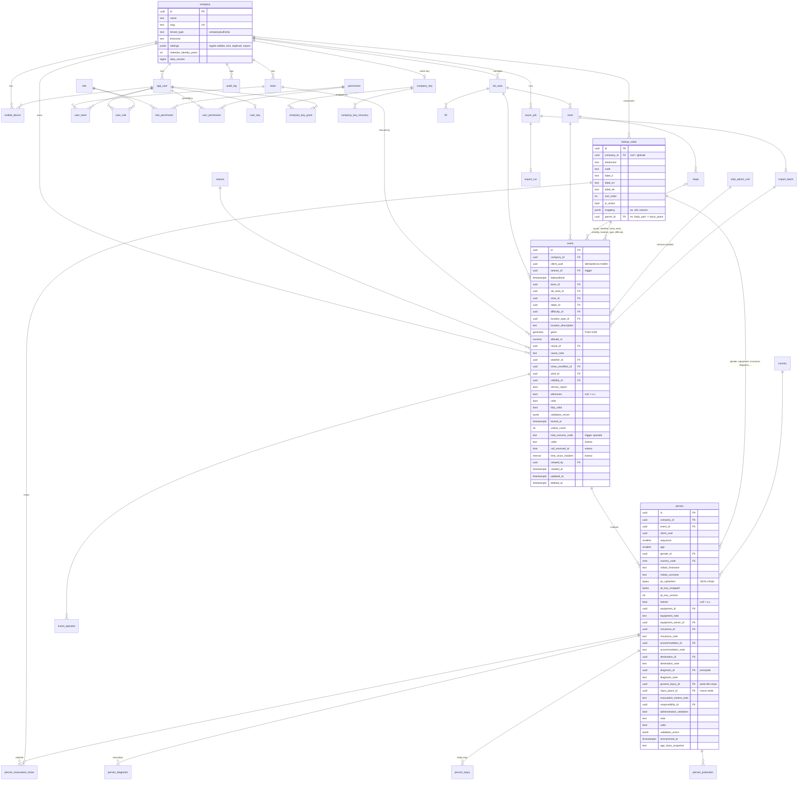

# 02 · Schema dati

DDL completo in [`02-ddl.sql`](02-ddl.sql). Questo documento spiega le scelte di modellazione e riporta l'ERD.

## 1. Regole di modellazione

1. **Chiavi**: UUID v7 (ordinabili nel tempo) per tutte le entità; `bigint` solo per `audit_log`.
2. **Tenant**: ogni tabella di dominio ha `company_id NOT NULL` anche quando derivabile
   (es. `person.company_id`), perché Row Level Security richiede la colonna sulla tabella.
3. **Vocabolari controllati**: un'unica tabella `lookup_value` con colonna `dimension`.
   Le FK puntano a `lookup_value.id`; un trigger verifica che la dimensione sia quella attesa
   (`cause`, `weather`, …). Le società possono aggiungere valori propri (`company_id` valorizzato)
   e disattivare valori globali (`company_lookup_disabled`). Ogni valore ha etichette IT/EN/DE,
   `sort_order`, e un `mapping` JSONB per i tracciati esterni (es. colonna A01).
4. **"Non classificato"**: in archivio è `NULL`; gli aggregatori usano sempre
   `COALESCE(code, 'unclassified')` e il payload dei grafici contiene sempre l'etichetta
   "Non classificato" (tradotta) anche quando vale zero. Nessun record viene mai escluso.
   I booleani che sul campo possono restare vuoti (`helmet`, `witnesses`, `administrative_violations`)
   sono `BOOLEAN NULL` (tri-stato).
5. **Stagione**: tabella `season` globale (`2025/2026` = 2025-06-01 → 2026-05-31); `event.season_id`
   è impostato da trigger a partire da `dateandtime` (fuso della società) e mai dal client.
6. **Dati identificativi**: `person` contiene solo `initials_*`, `age`, `gender`, `country_code` in
   chiaro. Tutto il resto (nome, cognome, luogo di nascita, indirizzo, città, telefono, email,
   codici assicurazione/skipass, "consegnato a") sta in `pii_ciphertext` (JSON cifrato con data key)
   e `pii_key_wrapped` (data key sigillata con la chiave pubblica della società).
7. **Diagnosi e lesioni**: `person.diagnosis_id` è la diagnosi presunta principale; le secondarie in
   `person_diagnosis`. `person.gravest_injury_id` è la parte del corpo principale (mappa corporea),
   `person.injury_place_id` la macro-sede (arti inferiori, …) derivata o impostata a mano.
8. **Mezzi di evacuazione**: `person_evacuation_mean(person_id, mean_id, "order")` con vincolo di
   unicità sull'ordine.
9. **Soft delete** su `event` e `person` (`deleted_at`); la cancellazione fisica avviene solo per
   retention. **Anonimizzazione** (`anonymized_at`): azzera `pii_*`, `initials_*`, `age` → resta `age_class_snapshot`.
10. **Cache invalidation**: `company.data_version` incrementato da trigger su `event`/`person`.
11. **Idempotenza mobile**: `client_uuid` univoco per società su `event` e `person`.
12. **Audit**: `audit_log` partizionata per mese, append-only (nessun `UPDATE/DELETE` concesso al ruolo applicativo), contiene solo id e nomi dei campi, mai valori PII.

## 2. ERD

## 3. Dizionario delle dimensioni (`lookup_value.dimension`)

| dimension | Usata da | Valori iniziali (code) |
|---|---|---|
| `cause` | event | accidental_fall, collision_person, collision_mobile_obstacle, illness, other (+ estesi: lift_fall, collision_fixed_obstacle, lift, off_piste) |
| `location_type` | event | open_slope, off_piste, closed_slope, lift, race_slope, building, snowpark, trail, lift_station, other |
| `slope_difficulty` | slope, event | ski_school, blue, red, black |
| `weather` | event | clear, partly_cloudy, cloudy, snow, rain, fog (+ blizzard) |
| `snow_condition` | event | packed, hard, fresh, powder, wet, crusty (+ icy, spring, no_snow) |
| `wind` | event | none, light, moderate, strong |
| `visibility` | event | good, fair, poor (+ insufficient) |
| `location_feature`, `traffic`, `snow_making`, `event_type` | event (estesi) | dal report di riferimento |
| `gender` | person | male, female, other |
| `equipment` | person | ski, snowboard, ski_touring, telemark, other (+ estesi: xc_ski, skiboard, sled, snowshoes, pedestrian…) |
| `equipment_owner` | person | own, rental, borrowed, unknown |
| `equipment_condition` | person (esteso) | poor, mediocre, good, excellent |
| `protection` | person_protection (esteso) | back, neck, chest, wrist, elbow, knee, shin, hip, goggles, gloves, none, other |
| `insurance` | person | none, skipass, snowcare, multisport, interski, carre_neige, caser, other |
| `accommodation` | person | tourist_facility, passing_through, own_or_friends, other |
| `destination` | person | trauma_center, er, public_clinic, private_clinic, home, deceased, foreign_country, other |
| `diagnosis` | person, person_diagnosis | contusion, sprain, closed_fracture, open_fracture, wound, contused_wound, penetrating_wound, dislocation, head_trauma, muscle_injury, strain, neurological, malaise, unharmed, other (+ estesi dal report) |
| `injury_place` | person | lower_limbs, upper_limbs, head_face, trunk |
| `body_part` | person_injury, person.gravest_injury | parti della mappa corporea con `parent_id` → injury_place |
| `evacuation_mean` | person_evacuation_mean | akja, snowmobile, ambulance, helicopter_118, lift, car, autonomous, other |
| `responsibility` | person | shared, own, third_party, undetectable |
| `person_role` | person (esteso) | involved, witness, companion, instructor, pupil, parent, other |
| `rescue_refusal` | person (esteso) | none, rescue_and_transport, transport_only, rescue_only |
| `team_body` | team | operator, carabinieri, alpine_troops, police, finance_guard, alpine_rescue, ems_118, other |
| `age_cluster:standard` | (virtuale, funzione SQL) | 0-17, 18-24, 25-34, 35-44, 45-54, 55-64, 65+ |
| `age_cluster:veneto_a01` | (virtuale) | 0-10, 11-20, 21-30, 31-40, 41-50, 51-60, 61-70, 71-80, 80+ |

## 4. Indici e prestazioni

- Tutte le tabelle tenant: indice che inizia con `company_id` (necessario anche perché RLS filtra sempre per `company_id`).
- `event`: `(company_id, dateandtime DESC)`, `(company_id, season_id, zone_id)`, `(company_id, team_id, dateandtime)`, `(company_id, slope_id)`, GiST su `geom`, parziale `WHERE deleted_at IS NULL`.
- `person`: `(company_id, event_id)`, `(company_id, country_code)`, `(company_id, diagnosis_id)`, `(company_id, equipment_id)`.
- Le query statistiche fanno join `person → event` su `(company_id, event_id)` e filtrano su `event`: con 100k eventi e 110k persone il piano è index scan + hash aggregate, sotto i 100 ms.
- `audit_log` partizionata mensilmente; indice `(company_id, created_at DESC)`, `(company_id, object_type, object_id)`.
- `istat_admin_unit.geom` GiST; il trigger su `event` calcola `istat_comune_code` una sola volta.

## 5. Vincoli principali

- `event.zone_id` deve appartenere a `event.ski_area_id`; `event.slope_id` a `event.zone_id` (trigger `chk_event_territory`).
- `event.team_id` deve appartenere alla stessa `company_id` (trigger `chk_same_company`; vale per tutte le FK verso tabelle tenant).
- `person.event_id` → `event` con `ON DELETE CASCADE`; `person.company_id` copiato dall'evento da trigger.
- `person.age BETWEEN 0 AND 120`; `initials_*` max 3 caratteri maiuscoli.
- `person_evacuation_mean`: `UNIQUE(person_id, "order")`, `UNIQUE(person_id, mean_id)`.
- `company_key_grant`: al più una grant attiva per `(company_key_id, user_id)` (indice parziale unico).
- `lookup_value`: `UNIQUE(dimension, code, COALESCE(company_id, '00000000-…'))`.
- `mobile_device`: `UNIQUE(company_id, install_id)`.
- RLS attiva e `FORCE` su tutte le tabelle tenant; policy `tenant_isolation` per `SELECT/INSERT/UPDATE/DELETE`.

## 6. Mapping import storico (`export.xlsx` → `event`)

| Colonna sorgente | Destinazione | Note |
|---|---|---|
| ID evento | `event.legacy_id` | conservato per riconciliazione |
| Stagione | verifica con `season` calcolata | warning se discordante |
| Data, Ore | `dateandtime` (Europe/Rome) | se `Ore` vuoto → 12:00 e flag `validation_errors.time_missing` |
| Stazione | `zone` (per nome, creata se assente) | la "stazione" del riferimento corrisponde alla Zona |
| Valido | ignorato (ricalcolato) | |
| Squadra | `team` (per nome) | |
| Pista, Difficoltà | `slope` (per nome nella zona), `difficulty` | |
| Descrizione del luogo | `location_description` | |
| Causa, Causa - testo | `cause` (mapping etichette IT → code), `cause_note` | |
| Meteo, Neve, Vento, Tipo di luogo | lookup per etichetta | valori non mappati → NULL + warning |
| Service report, Testimoni | booleani | "Si"/"No"/vuoto |

Il mapping per le persone sarà definito quando disponibile il campione (vedi Q15).
